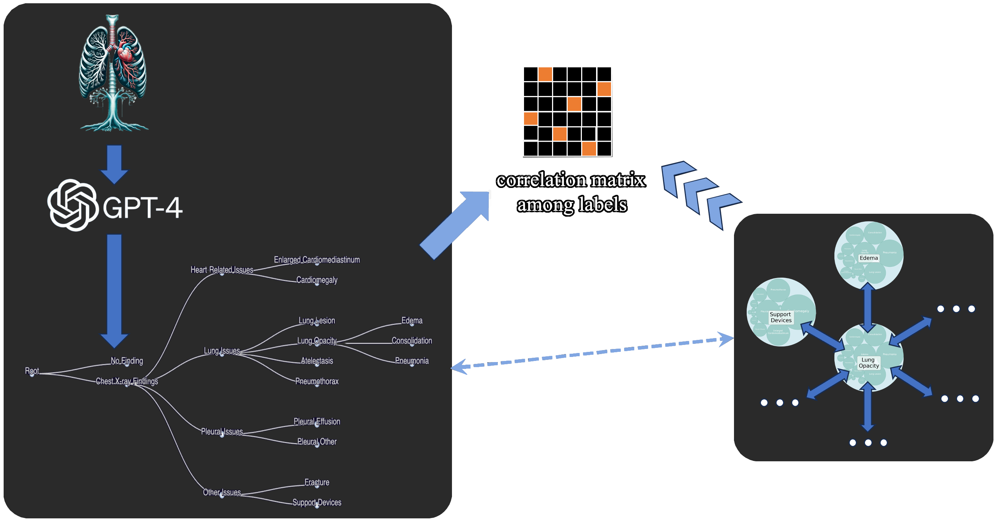

# Fine-grained Feature Alignment via Contrastive Learning

 
 
 

  

  Generated by GPT-4

### Abstract
Leveraging multimodal data, the Visual Language Model(VLM) demonstrated impressive capability of bridging the
knowledge in multi-modalities. VLMs like CLIP, Flamingo, and DALL-E, which are trained based on the tremendous
amount of data and computational resources show good performance in many different downstream tasks due to the good generalizability. However, like a double-edged sword, the generalizability of pre-trained VLMs limits their performance in the customized setting. In this project, I try to leverage the prior knowledge in pre-trained VLMs and customize the embedding generation in my general classification task. Using the simple contrastive learning method proposed in the report, a robust generalist classifier is available with the deficiency of training data which is a ubiquitous context in the biomedical setting.

> **A feature representation task.**  
> currently using the Classification task as a utility task, aiming to build a general disease detecter via chest x-ray.  
> **This project tries to explore the data cooperation between multimodal data -- text and image**, and then improve AI downstream tasks.

### Problem Description:
To alleviate the workload of radiologists, researchers develop algorithms that can automatically classify X-ray images into different classes (corresponding to the existence of different diseases discovered in X-ray images).   
even though, the current SOTA specialist model (customized model for one certain disease) gets very good performance, a generalist model (capable of handling multiple diseases simultaneously) is still weak.  
In this context, what I want to do is establish an algorithm which capable of detecting multiple diseases from X-ray images.  

### Challenges:
To solve this problem, I need to interface 2 main challenges
1. data scarcity -- clinical data is always scarce due to private code
2. generalizability -- how can I improve the generalizability of the model to tackle several different diseases
   
### Potential Solutions 
1. leveraging the knowledge in the powerful pre-trained LLMs to guide the feature extraction in my image classification task
2. using a knowledge graph to inject the prior knowledge of different diseases into my feature extractor.

### Model  
</img>
Using contrastive learning to align the diseases' representation between text and image, leveraging the power of LLMs to guild the feature extraction in the image branch.

### Pathology correlation:
 In reality, the diseases diagnosed from X-ray images are supposed to be correlated with each other to some extent. **Therefore**, the totally orthogonalizing  may not make sense.    
 To inject the prior knowledge of this correlation, I use graph to represent the hierarchical relation between my 14 labels, and hope this prior knowledge can guild the model learning.

  
  
Hierarchical relation tree of 14 labels

     

### AUC comparison among 14 labels 

  
  
AUC comparision among 14 labels(config: grpah+NoOrth+NoContrastive)

   
AUC improves 3.38%

  
  
AUC comparision among 14 labels(config: grpah+NoOrth+NoContrastive)

   
AUC improves by 6.29%. By injecting customized knowledge, the model performance in <b>fracture</b> improves obviously, which is the most challenging for discrimination <a href=#reference>[3]</a>.

### Reference
[1] [Towards long-tailed, multi-label disease classification from chest X-ray: Overview of the CXR-LT challenge](https://arxiv.org/pdf/2310.16112v1.pdf)  
[2] [Xplainer: From X-Ray Observations to Explainable Zero-Shot Diagnosis](https://arxiv.org/pdf/2303.13391.pdf)  
[3] [CheXclusion: Fairness gaps in deep chest X-ray classifiers](https://arxiv.org/pdf/2003.00827v2.pdf)    
[4] [A Simple General Approach to Balance Task Difficulty in Multi-Task Learning](https://arxiv.org/pdf/2002.04792.pdf)    
[5] [Multi-Task Learning Using Uncertainty to Weigh Losses
for Scene Geometry and Semantics](https://arxiv.org/pdf/1705.07115.pdf)     
[6] [Attentional Mixtures of Soft Prompt Tuning
for Parameter-efficient Multi-task Knowledge Sharing](https://homes.cs.washington.edu/~akari/papers/attempt_preprint.pdf)      
[7] [A Pilot Study of Query-Free Adversarial Attack against Stable Diffusion](https://arxiv.org/pdf/2303.16378.pdf)    

